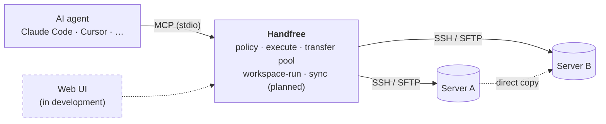

<div align="center">

<picture>
  <source media="(prefers-color-scheme: dark)" srcset="images/brand/logo-dark.svg">
  
</picture>

### The SSH workbench for AI agents

Configure your servers once. Your agent runs commands, moves files and launches long jobs on them — within the limits you set.

[](https://www.npmjs.com/package/@aaarc/handfree-ssh-mcp)
[](https://www.npmjs.com/package/@aaarc/handfree-ssh-mcp)
[](https://modelcontextprotocol.io)
[](LICENSE)

**English** · [简体中文](README_CN.md)

</div>

---

Handfree is an [MCP](https://modelcontextprotocol.io) server that gives an AI agent — Claude Code, Claude Desktop, Cursor, or any MCP client — hands-free access to your SSH servers. It reads the `~/.ssh/config` you already have, enforces a command policy per server, and goes well beyond running a command: fast multi-connection transfers, direct server-to-server copies, and durable remote jobs that survive disconnects.

## Capabilities

<table>
<tr>
<td width="33%" valign="top">
<br>
<b>Connect</b><br>
Reuses <code>~/.ssh/config</code>, jump-host chains, SOCKS, keepalive, hot-reloaded config and pooled connections.
</td>
<td width="33%" valign="top">
<br>
<b>Execute</b><br>
Per-server blacklist or whitelist policy, background streaming with polling, full output logs on disk.
</td>
<td width="33%" valign="top">
<br>
<b>Transfer</b><br>
Multi-connection upload / download / relay, direct A→B copy, batch and recursive transfers, atomic replace.
</td>
</tr>
<tr>
<td valign="top">
<br>
<b>Run</b><br>
<code>workspace-run</code>: push code → run → collect artifacts. State lives on the remote; cancel and retry are safe.
</td>
<td valign="top">
<br>
<b>Sync</b> <sub>planned</sub><br>
Push, pull and bidirectional file sync, with a flush barrier before every run.
</td>
<td valign="top">
<br>
<b>Web UI</b> <sub>in development</sub><br>
A dashboard for runs, transfers and servers, alongside the MCP interface.
</td>
</tr>
</table>

## How it fits together



## Quick start

**1. Have a host in `~/.ssh/config`** — nothing else is required:

```sshconfig
Host dev
  HostName 192.168.1.100
  User root
  IdentityFile ~/.ssh/id_ed25519
```

**2. Add Handfree to your MCP client.**

<details open>
<summary><b>Claude Code</b></summary>

```bash
claude mcp add ssh -- npx -y @aaarc/handfree-ssh-mcp --enable-servers dev
```

</details>

<details>
<summary><b>Claude Desktop, Cursor and other JSON-configured clients</b></summary>

```json
{
  "mcpServers": {
    "ssh": {
      "command": "npx",
      "args": ["-y", "@aaarc/handfree-ssh-mcp", "--enable-servers", "dev"]
    }
  }
}
```

</details>

`--enable-servers` is optional; without it every concrete `Host` is enabled.

**3. Optionally, add a policy overlay** with `--config servers.yaml`:

```yaml
servers:
  prod:
    commandMode: whitelist     # default is blacklist
    whitelist: ["^ls.*$", "^cat .*$", "^tail .*$"]
    allowedRemoteDirectories: [/srv/app, /tmp]
```

That's it — ask your agent to check the logs on `dev`, deploy to `prod`, or train a model on the GPU box.

## What your agent gets

| Area | Tools |
|---|---|
| Discover | `list-servers`, `show-whitelist`, `help` |
| Execute | `execute-command` (streams in the background; poll with `command-status`), `close-connection` |
| Transfer | `upload`, `download`, `transfer` (upload / download / relay, recursive, batch, archive) |
| Run | `workspace-run`, `run-status`, `run-logs`, `run-list`, `run-cancel`, `run-retry` |

Every parameter is documented in [docs/tools.md](docs/tools.md).

## Performance

A single SSH connection is capped by its channel's flow-control window, so on a high-latency link one connection cannot fill the pipe. With `connections: N`, one file moves over N independent connections, and the pool keeps them warm for the next call.

<picture>
  <source media="(prefers-color-scheme: dark)" srcset="images/charts/download-dark.svg">
  
</picture>

Measured on a real `tc netem` lab link; the gain on your own link depends on its RTT and bandwidth, and there is none on a fast LAN. Upload and relay figures, the method, and the limits are in [docs/transfer.md](docs/transfer.md).

## Safety

> [!IMPORTANT]
> Credentials never reach the model. The agent names a server; Handfree holds the keys.

> [!WARNING]
> The default command mode is **blacklist**: built-in guards block power commands, recursive force-deletes and similar, and everything else is allowed. For production hosts, set `commandMode: whitelist`.

- SFTP transfers can be confined to `allowedRemoteDirectories` / `allowedLocalDirectories`.
- Direct server-to-server copies never pass a private key and never auto-accept an unknown host key.
- `run-cancel` re-verifies the process identity (boot id, pid, start time, wrapper token) before sending any signal.

Details: [docs/configuration.md](docs/configuration.md#security-note-command-policy).

## Roadmap

| Status | Item |
|---|---|
| ✅ | Command policy, streaming execution, full output logs |
| ✅ | Multi-connection transfers with a per-server connection pool |
| ✅ | Direct server-to-server transfer (`strategy: direct / auto`) |
| ✅ | `workspace-run`: push, run, collect, cancel, retry |
| 🚧 | Web UI — dashboard for runs, transfers and servers |
| 🗓️ | Sync engine — push / pull / bidirectional, run barrier |
| 🗓️ | Retry-with-reconnect for SFTP transfers |
| 🗓️ | Conda / module / Slurm run environments, GPU checks |

## Documentation

- [Configuration](docs/configuration.md) — YAML reference, command & SFTP policy, jump hosts, connection lifecycle, CLI options
- [Tools](docs/tools.md) — every tool and parameter
- [Transfers](docs/transfer.md) — skip-if-identical, archive mode, batch upload, multi-connection, direct copy
- [workspace-run](docs/workspace-run.md) — remote runner pipeline, state, cancel and retry

## Credits & license

Handfree started as a fork of [classfang/ssh-mcp-server](https://github.com/classfang/ssh-mcp-server). Thanks to the original author for the foundation.

ISC License · Original work © 2025 junki.cn · Modifications © 2026 woqucc

<sub>🧪 Almost entirely AI-written, this README included.</sub>
