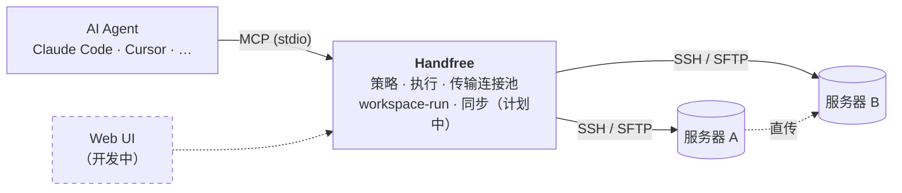
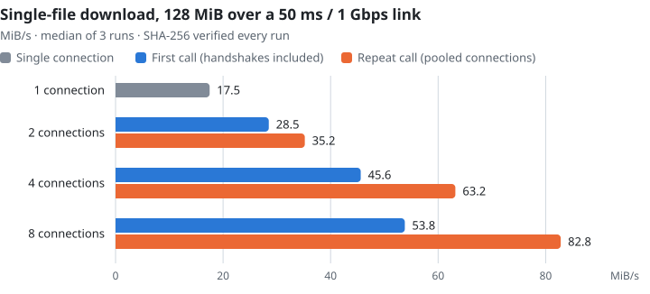

<div align="center">

<picture>
  <source media="(prefers-color-scheme: dark)" srcset="images/brand/logo-dark.svg">
  
</picture>

### 面向 AI Agent 的 SSH 工作台

服务器只配置一次。之后由 Agent 在你设定的边界内执行命令、传输文件、启动长时间任务。

[](https://www.npmjs.com/package/@aaarc/handfree-ssh-mcp)
[](https://www.npmjs.com/package/@aaarc/handfree-ssh-mcp)
[](https://modelcontextprotocol.io)
[](LICENSE)

[English](README.md) · **简体中文**

</div>

---

Handfree 是一个 [MCP](https://modelcontextprotocol.io) 服务器，让 AI Agent（Claude Code、Claude Desktop、Cursor 或任何 MCP 客户端）免手动地使用你的 SSH 服务器。它直接读取你已有的 `~/.ssh/config`，按服务器执行命令策略；能力远不止执行命令：多连接加速传输、服务器之间直传、断线也不丢的远程长任务。

## 能力

<table>
<tr>
<td width="33%" valign="top">
<br>
<b>连接</b><br>
复用 <code>~/.ssh/config</code>，支持多级跳板机、SOCKS、keepalive、配置热重载与连接池。
</td>
<td width="33%" valign="top">
<br>
<b>执行</b><br>
按服务器配置黑名单或白名单；后台流式执行、轮询输出；完整输出落盘。
</td>
<td width="33%" valign="top">
<br>
<b>传输</b><br>
多连接上传 / 下载 / 中转，A→B 直传，批量与递归传输，原子替换。
</td>
</tr>
<tr>
<td valign="top">
<br>
<b>运行</b><br>
<code>workspace-run</code>：推送代码 → 运行 → 收回产物。状态存在远端，取消与重试都安全。
</td>
<td valign="top">
<br>
<b>同步</b> <sub>计划中</sub><br>
push / pull / 双向文件同步，每次运行前执行 flush 屏障。
</td>
<td valign="top">
<br>
<b>Web UI</b> <sub>开发中</sub><br>
运行任务、传输与服务器的可视化面板，与 MCP 接口并存。
</td>
</tr>
</table>

## 整体结构



## 快速开始

**1. `~/.ssh/config` 里有一个 Host 即可**，不需要其他配置：

```sshconfig
Host dev
  HostName 192.168.1.100
  User root
  IdentityFile ~/.ssh/id_ed25519
```

**2. 把 Handfree 加入 MCP 客户端。**

<details open>
<summary><b>Claude Code</b></summary>

```bash
claude mcp add ssh -- npx -y @aaarc/handfree-ssh-mcp --enable-servers dev
```

</details>

<details>
<summary><b>Claude Desktop、Cursor 等使用 JSON 配置的客户端</b></summary>

```json
{
  "mcpServers": {
    "ssh": {
      "command": "npx",
      "args": ["-y", "@aaarc/handfree-ssh-mcp", "--enable-servers", "dev"]
    }
  }
}
```

</details>

`--enable-servers` 可省略，省略时启用所有具体的 `Host`。

**3. 可选：用 `--config servers.yaml` 叠加策略**：

```yaml
servers:
  prod:
    commandMode: whitelist     # 默认是 blacklist
    whitelist: ["^ls.*$", "^cat .*$", "^tail .*$"]
    allowedRemoteDirectories: [/srv/app, /tmp]
```

完成。现在可以让 Agent 去 `dev` 上看日志、往 `prod` 部署，或者在 GPU 机器上训练模型。

## Agent 能用的工具

| 类别 | 工具 |
|---|---|
| 发现 | `list-servers`、`show-whitelist`、`help` |
| 执行 | `execute-command`（后台流式执行，用 `command-status` 轮询）、`close-connection` |
| 传输 | `upload`、`download`、`transfer`（上传 / 下载 / 中转，递归、批量、打包） |
| 运行 | `workspace-run`、`run-status`、`run-logs`、`run-list`、`run-cancel`、`run-retry` |

全部参数见 [docs/tools.md](docs/tools.md)（英文）。

## 性能

单条 SSH 连接的吞吐被其 channel 流控窗口限制，高延迟链路上一条连接跑不满带宽。设置 `connections: N` 后，一个文件走 N 条独立连接；连接池让这些连接在下一次调用时直接复用。

<picture>
  <source media="(prefers-color-scheme: dark)" srcset="images/charts/download-dark.svg">
  
</picture>

数据来自真实 `tc netem` 实验链路；你自己链路上的收益取决于 RTT 与带宽，局域网上没有收益。上传、中转的数字、测量方法与限制见 [docs/zh/transfer.md](docs/zh/transfer.md)。

## 安全

> [!IMPORTANT]
> 凭证永远不会交给模型。Agent 只说服务器名，密钥由 Handfree 持有。

> [!WARNING]
> 默认命令模式是**黑名单**：内置规则拦截关机、递归强制删除等危险命令，其余放行。生产主机请设置 `commandMode: whitelist`。

- SFTP 传输可限制在 `allowedRemoteDirectories` / `allowedLocalDirectories` 内。
- 服务器之间直传不会传递任何私钥，也不会自动信任未知主机指纹。
- `run-cancel` 发信号前会重新核对进程身份（boot id、pid、启动时间、wrapper token）。

详见 [docs/configuration.md](docs/configuration.md#security-note-command-policy)（英文）。

## 路线图

| 状态 | 项目 |
|---|---|
| ✅ | 命令策略、流式执行、完整输出日志 |
| ✅ | 多连接传输与按服务器的连接池 |
| ✅ | 服务器之间直传（`strategy: direct / auto`） |
| ✅ | `workspace-run`：推送、运行、收产物、取消、重试 |
| 🚧 | Web UI：运行任务、传输与服务器面板 |
| 🗓️ | 同步引擎：push / pull / 双向，运行前屏障 |
| 🗓️ | SFTP 传输断线重连重试 |
| 🗓️ | Conda / module / Slurm 运行环境、GPU 校验 |

## 文档

- [配置](docs/configuration.md)（英文）：YAML 参考、命令与 SFTP 策略、跳板机、连接生命周期、命令行参数
- [工具](docs/tools.md)（英文）：全部工具与参数
- [文件传输](docs/zh/transfer.md)：分块预取、直传、打包、批量上传、多连接
- [workspace-run](docs/zh/workspace-run.md)：远程运行流水线、状态、取消与重试

## 致谢与许可

Handfree 起源于 [classfang/ssh-mcp-server](https://github.com/classfang/ssh-mcp-server) 的分支，感谢原作者打下的基础。

ISC 许可证 · 原作 © 2025 junki.cn · 修改部分 © 2026 woqucc

<sub>🧪 几乎全部由 AI 编写，包括这份 README。</sub>
